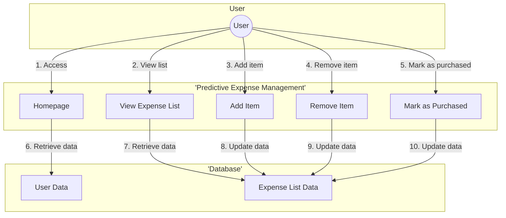

# Predictive Expense Management

This project aims to enhance SAP Concur by incorporating Predictive Expense Management features. The goal is to leverage data analytics and machine learning to predict and manage expenses more effectively, providing users and organizations with insights to optimize spending, improve budget planning, and enhance overall financial decision-making.

## Table of Contents

- [Installation](#installation)
- [Usage](#usage)
- [Contributing](#contributing)
- [License](#license)

## Installation

1. Clone the repository:

```bash
git clone https://github.com/your-username/predictive-expense-management.git
```

2. Install the required dependencies:

```bash
npm install
```

## Usage

To use Predictive Expense Management, follow these steps:

1. Integrate historical expense data into SAP Concur for analysis and modeling.
2. Ensure seamless data synchronization to provide a foundation for predictive analytics.
3. Implement a machine learning framework within SAP Concur to enable predictive modeling.
4. Select and integrate suitable machine learning algorithms for expense prediction and anomaly detection.
5. Develop a user-friendly dashboard within SAP Concur to display predicted future expenses based on historical data.
6. Include visual representations of spending trends and predictions.
7. Integrate Predictive Expense Management with the budgeting module in SAP Concur.
8. Enable users to set and adjust budgets based on predictions and insights.
9. Implement algorithms to predict potential policy compliance issues before expenses are submitted.
10. Provide users with real-time alerts and suggestions to align expenses with corporate policies.

## Contributing

We welcome contributions from the community! If you're interested in contributing to Predictive Expense Management, please review our [contribution guidelines](CONTRIBUTING.md).

## License

This project is licensed under the [MIT License](LICENSE). 
